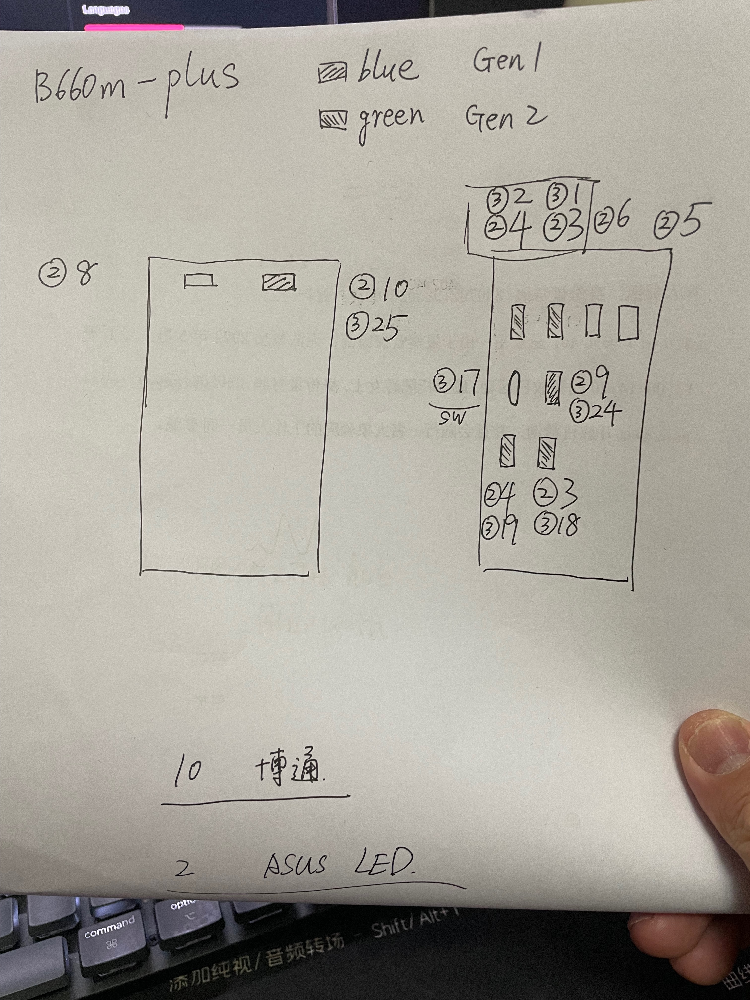
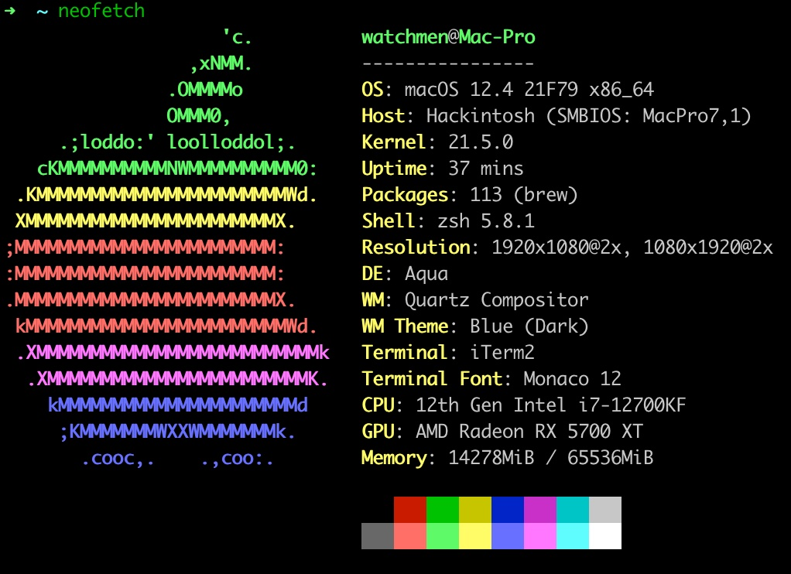
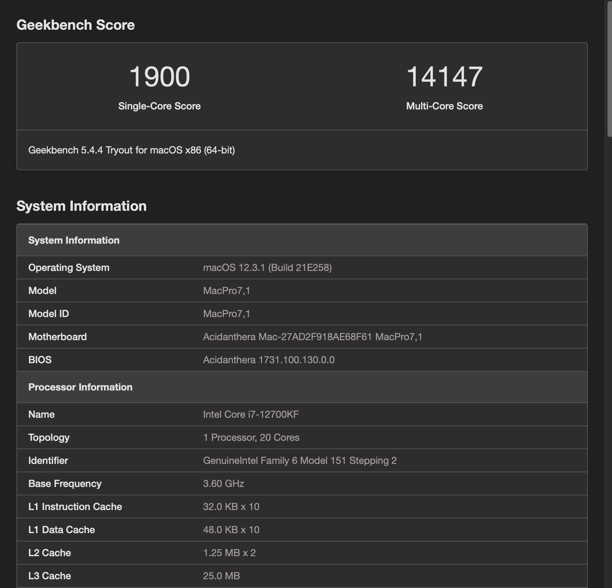
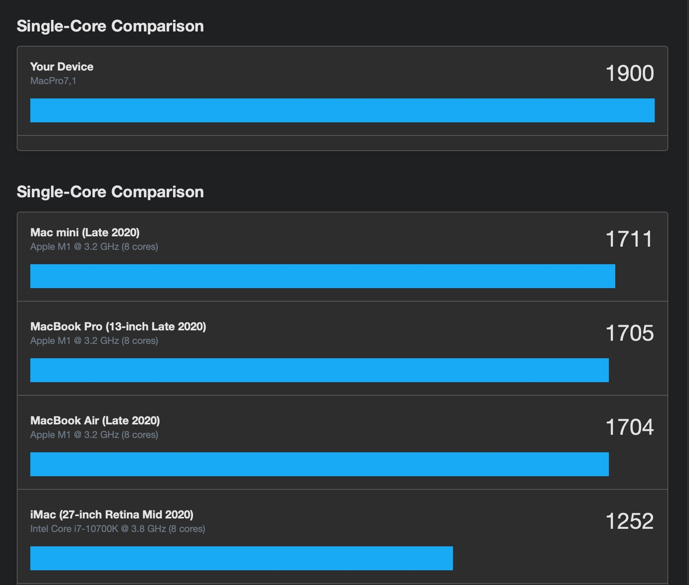
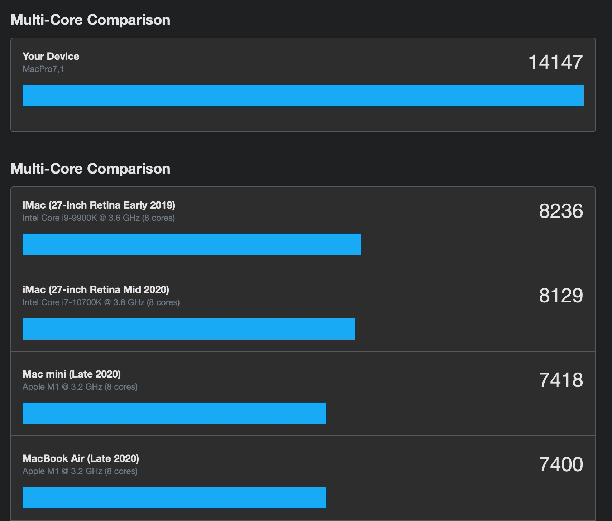
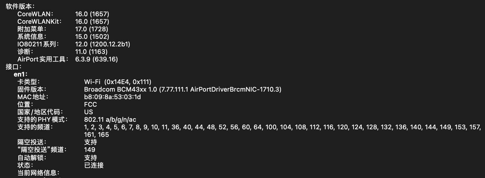
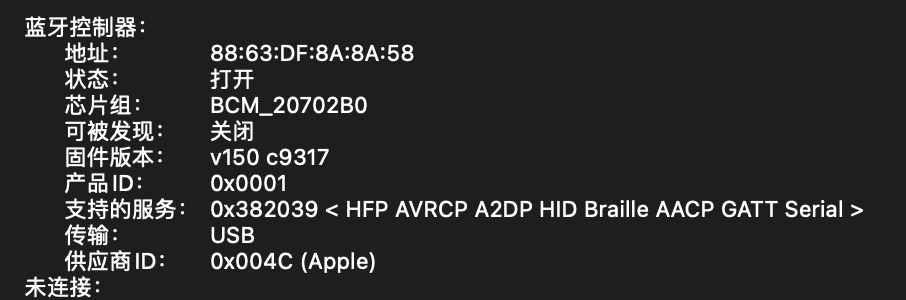
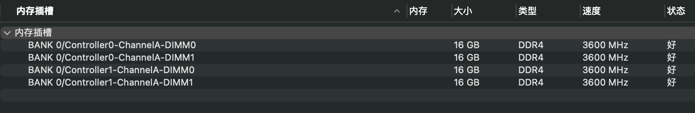
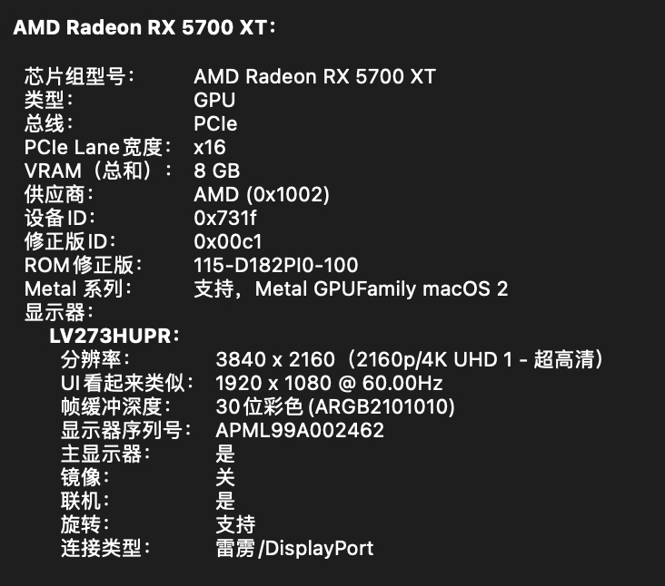

# i7-12700kf_ASUS-B660M-PLUS-D4_5700xt

基于opencore `0.8.1`版本，适用于华硕ASUS TUF GAMING B660M-PLUS D4主板和12代intelCPU，i7-12700kf的黑苹果引导文件，系统是Monterey `12.4`。因为就是冲着装黑苹果去的，所以购买硬件之前CPU特意买了没有核显的F系列(有也驱动不了)，主板没有买WIFI版本，板载WIFI网卡虽然可以驱动，但是隔空等功能受限。

### 更新
- 2022-10-28 更新opencore`0.8.5`，系统可正常运行`Ventura 13.0 正式版` [下载](https://github.com/echokk11/Hackintosh_i7-12700kf_ASUS-B660M-PLUS-D4_5700xt/releases/download/v0.85/EFI-opencore0.8.5-Ventura.zip)
- 2022-07-05 更新opencore`0.8.2`，系统可正常运行`Ventura 13.0 beta2` [下载](https://github.com/echokk11/Hackintosh_i7-12700kf_ASUS-B660M-PLUS-D4_5700xt/blob/main/EFI-opencore0.8.2-Ventura.zip)

### 硬件列表

- CPU：Intel i7-12700kf
- 主板：ASUS TUF GAMING B660M-PLUS D4
- 内存：金士顿骇客神条3600Mhz 16G*4
- 存储：西数SN850 1T(macOS),三星980Pro 1T副盘(Win11)
- 显卡：ASUS ROG RX 5700XT 8G
- 网卡：Fenvi T-919(BCM94360CD) 免驱，用于wifi和bluetooth
- 散热：利民PA120,买了两块纯铜条贴着980Pro
- 电源：750W安钛克NEO金牌全模组
- 机箱：tt起航者s3，mini小机箱

### 运行情况

基本上完美运行，可以登陆icloud账号，隔空，接力都能使用，机型是Mac Pro(2019)，打了CPU补丁后CPU单核跑分略高于2020年M1的Mac Mini，多核就比较优势了

### BIOS

我用的是截止目前最新的bios版本`1402`

只需要在boot启动那里把快速启动关闭即可，其他选项我试了其实开不开都不影响，VT-d不关闭也不影响，Above 4G，Hand-Off等这些默认都是开启的，无需修改

不需要关闭E-Core和超线程

三星980 PRO是不是有不兼容的情况，安装完后会出现磁盘hash不正确的提示，然后系统有间歇性的卡顿，建议用这块ssd的观察下。已用wd的SN850替换，卡顿顿时消失了。。。

### 关闭CFG Lock

非常重要，不然会无故重启，我的这块ASUS主板的bios里可能没有这一项，实际上是开着的，需要按照opencore的官方文档关闭，会用到`ControlMsrE2.efi`和`modGRUBShell.efi`两个工具，结合`UEFITool`和`ifrextract`

参见文档 https://dortania.github.io/OpenCore-Post-Install/misc/msr-lock.html#checking-via-controlmsre2

### 使用工具

安装之前的工具都是windows版本（都没有苹果系统，你给我苹果的软件有啥用对吧，当然有mac产品的另当别论），强烈建议安装黑苹果之前先安装个windows 10把ACPI等和本机相关的`DSDT`和`SSDT`文件导出使用，顺便把USB也一起定制了

- OCAuxiliaryTools 

  Opencore `config.plist`可视化编辑软件，多平台版本都有，下载地址https://github.com/ic005k/OCAuxiliaryTools

- SSDTTime

  导出和本机硬件相关的ACPI文件，下载地址https://github.com/corpnewt/SSDTTime

- USBToolBox

  USB定制工具，依赖python，下载地址https://github.com/USBToolBox/tool

  我的机箱定制如图:

  

- ProperTree

  也是config.plist的编辑工具，这个是遵循原始的XML格式，UI工具有很小的概率会保存出现格式错误，这个不会，也是依赖于python，下载地址https://github.com/corpnewt/ProperTree

安装完黑苹果后在MacOS下还需要用到以下软件

- OCAuxiliaryTools

- ProperTree

- Hackintool

  非常有用的黑果管理查看工具，下载地址https://github.com/headkaze/Hackintool

- Opencore Configurator

  也是config.plist的编辑软件，比较稳定需要对应版本使用，下载地址https://mackie100projects.altervista.org/download-opencore-configurator/

- MaciASL

  修改查看和编译DSDT和SSDT文件的工具，下载地址https://github.com/acidanthera/MaciASL

- IORegistyExplorer

  查看硬件信息用的，说实话我也不是很懂😂

所有用到的软件下载地址都是最原始的出处，可以保证是最正宗的软件，不放网盘的原因是因为本身这些软件迭代快，缺点就是相关网站打开速度慢，如何访问快不在本文范围之内。

安装教程请参考[B站**大头蔡Cass**的系列教程](https://www.bilibili.com/video/BV113411n7W3?spm_id_from=333.999.0.0)

12代还可以参考下这里的翻译文章
- https://zhuanlan.zhihu.com/p/487736399
- https://github.com/alyxferrari/OpenCore-Install-Guide/blob/alderlake/config.plist/alder-lake.md

### 注意事项

下列相关信息本仓库的EFI都已经修改，但是列出这些注意点是纯属想和广大黑苹果爱好者分享，讨论，有错误请修改指教

- 12代的CPU需要在config.plist中的kernel->Quieks下勾选ProvideCurrentCpuInfo
- 需要用CPUFriend和CPUFriendFriend两个text设置CPU工作频率，我按照大头菜的视频设置GeekBench5跑分只有一半，后来重新设置可以跑出正常的分数
- 已经去掉三码，使用前需要重新生成三码，可以用`OCAuxiliaryTools`生成，方便快捷

### 部分系统截图

